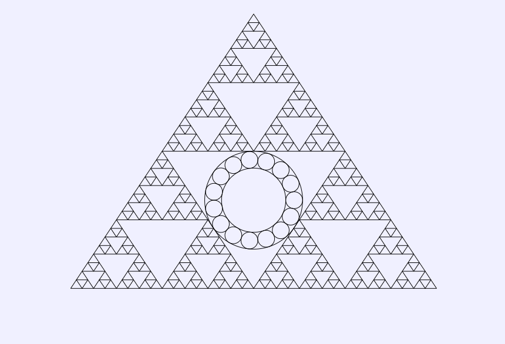
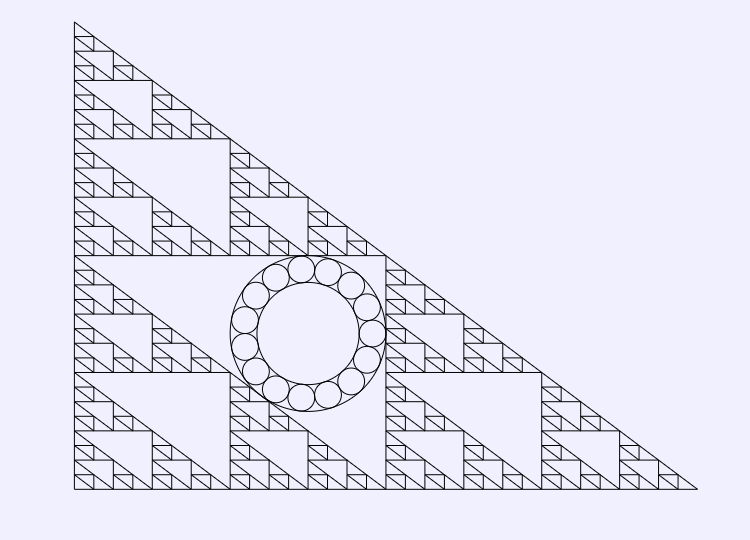
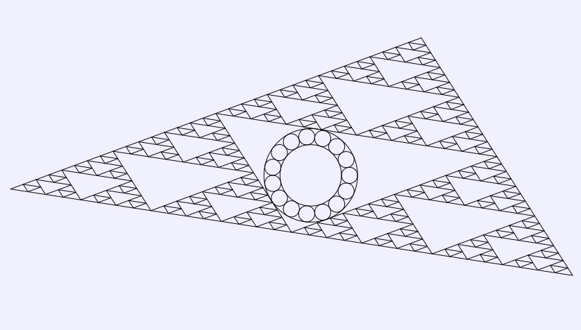
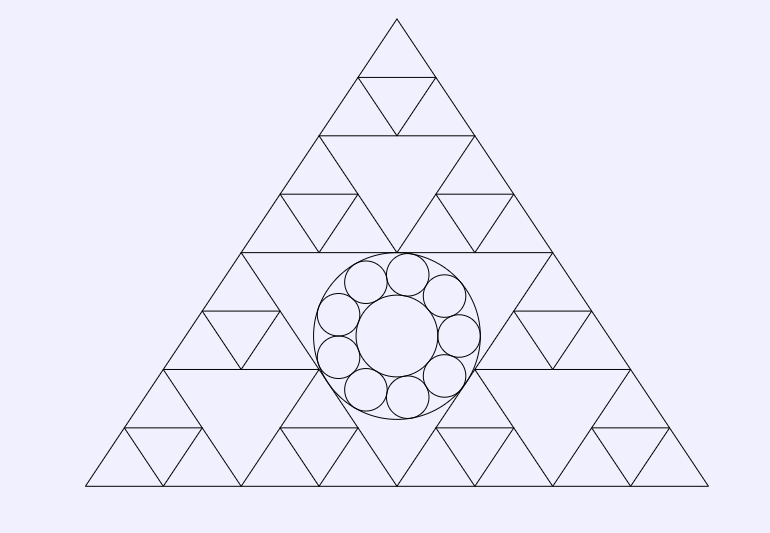
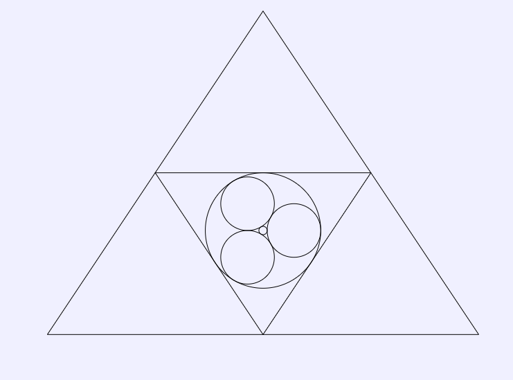

# Sierpinski-Steiner (GCLC)

Projekat predstavlja vizuelizaciju fraktalne strukture `trougla Sjerpinjskog` i dinamičkog `Štajnerovog lanca`, implementiranih u sistemu
`GCLC (Geometry Constructions → LaTeX Converter)`. Cilj je da se
prikaže kako se formalni geometrijski jezik GCLC-a može koristiti za
opis, konstrukciju i animaciju složenih struktura.

## 📌 Sažetak projekta

U okviru projekta realizovana je integracija dve matematičke ideje:

-   **Trougao Sjerpinjskog** - dobijen rekurzivnim deljenjem trougla na
    tri manja,
-   **Štajnerov lanac** - niz međusobno tangentnih kružnica unutar i oko
    zadate kružnice.

Ove strukture kombinuju se u jedinstvenu vizuelnu celinu. **Rotirajući Štajnerov lanac postavlja se u centar fraktalne strukture
trougla Sjerpinjskog**.

## 🧩 Ključne komponente

### 1. Trougao Sjerpinjskog

-   Rekurzivna definicija
-   Nivo fraktala definisan parametrom `N`

### 2. Štajnerov lanac

-   Konstrukcija tangentnih kružnica
-   Poluprečnici i rastojanja izvedeni klasičnim formulama
-   Broj kružnica zavisi od nivoa fraktala (`3N`)
-   Lanac postavljen unutar centralnog trougla

### 3. GCLC animacija

-   Rotacija celog lanca oko centra kružnice
-   Jasno razdvajanje statičkog (fraktal) i dinamičkog dela (lanac)

## 🖼️ Galerija (primer izlaza)

Ovde su prikazane različite vrste trouglova za različite vrednosti ulaznog parametra `N`:

### 🔹 N = 5

### 🔹 N = 3

### 🔹 N = 1

